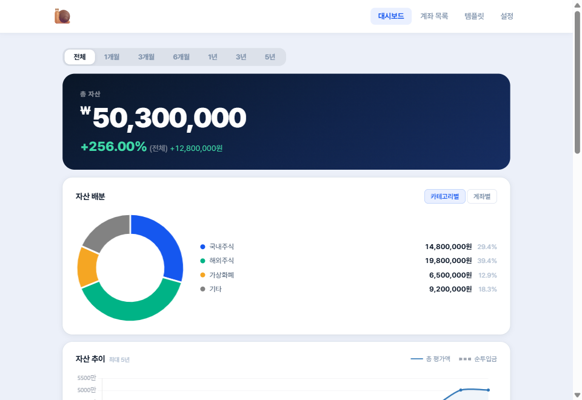
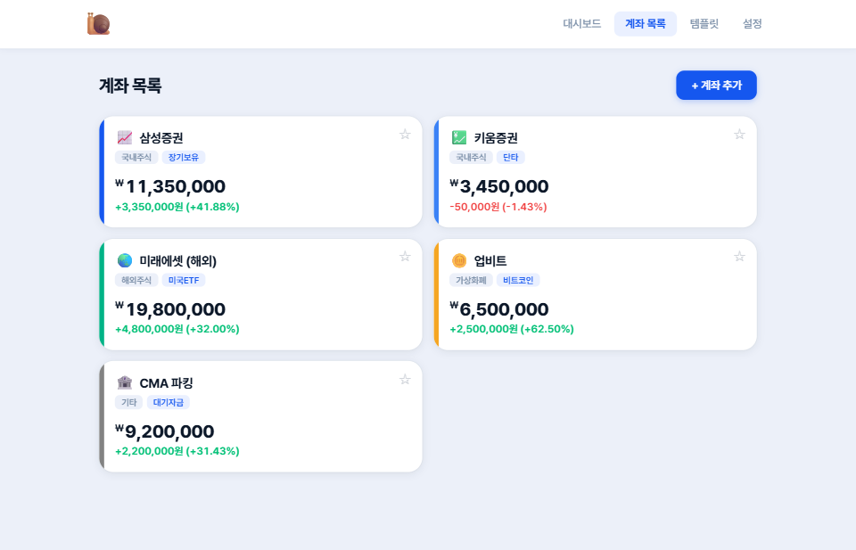

# 🐌 snail-portfolio

개인 투자 자산을 계좌별로 추적·분석하는 웹앱입니다. 설치·회원가입 없이 브라우저에서 바로 실행됩니다.

---

## 🚀 바로 사용하기

<p align="center">
  <a href="https://jwj51720.github.io/snail-portfolio/" target="_blank">
    
  </a>
</p>

| 사용 옵션 | 설명 |
|---|---|
| 🌐 배포 링크 접속 | GitHub Pages로 배포된 버전을 바로 사용 |
| 📁 파일 직접 실행 | Repository Clone 후 `index.html`을 브라우저에서 열어 사용 |
| 🖥️ 로컬 서버 실행 | 직접 로컬 서버를 띄워 사용 |

---

> **🔒 데이터 보안 안내**
>
> 입력한 모든 데이터는 **사용자 본인의 브라우저 내부 저장소에만 보관**됩니다.
> 어떠한 서버에도 전송되거나 저장되지 않으며, 외부에서 접근할 수 없습니다.
> 브라우저 데이터를 초기화하면 삭제될 수 있으므로, **정기적인 엑셀 내보내기를 권장합니다.**

---

<div align="center">
<table>
  <tr>
    <td align="center" width="33%">
      
      <sub><b>대시보드</b></sub>
    </td>
    <td align="center" width="33%">
      
      <sub><b>계좌 목록</b></sub>
    </td>
    <td align="center" width="33%">
      
      <sub><b>배분 템플릿 · 목표</b></sub>
    </td>
  </tr>
</table>
</div>

---

## 핵심 기능

| 기능 | 설명 |
|------|------|
| 계좌 관리 | 증권사·코인거래소 계좌를 카테고리·색상·이모지로 구분해 관리 |
| 거래 기록 | 입금·출금·스냅샷(평가액 직접 기록) 3가지 유형 |
| 대시보드 | 총 자산, 기간 수익률, 카테고리·계좌별 비중 차트, 자산 추이 |
| 수익률 계산 | 단순 수익률 / 시간가중수익률(TWR) 선택 |
| 배분 템플릿 | 고정금액·비율 방식으로 여러 계좌에 일괄 입금 |
| 목표 설정 | 목표 금액 설정 및 달성 시점 예측 |
| 엑셀 백업 | `.xlsx` 내보내기·가져오기 (데이터 이전·복원) |

---

## 실행 방법

`index.html`을 브라우저로 열면 즉시 실행됩니다.

- 인터넷 연결은 Chart.js·SheetJS 등 외부 라이브러리 로드에 필요합니다 (최초 1회 이후 캐시됨)
- 별도 서버·빌드 과정 없음

---

## 데이터 저장 방식

데이터는 브라우저 내부 저장소(Web Storage API)에 자동으로 저장되며, 탭을 닫아도 유지됩니다.
사용자의 하드 드라이브나 외부 서버에는 저장되지 않습니다.
저장 공간 초과 등 오류 발생 시 화면 상단에 경고 배너와 내보내기 버튼이 표시됩니다.

---

## 수익률 계산 방식

**단순 수익률** — 현재 평가액에서 순 투입금(입금 합계 − 출금 합계)을 뺀 뒤 순 투입금으로 나눈 값입니다.

**시간가중수익률(TWR)** — 입출금 시점마다 구간을 분리해 각 구간 수익률을 연결 곱합니다. 외부 현금흐름의 영향을 제거하므로 운용 능력을 보다 순수하게 측정할 수 있습니다.

---

## 파일 구조

```
snail-portfolio/
├── index.html
├── style.css
├── assets/
│   └── snailrise.png
└── js/
    ├── storage.js          # 브라우저 저장소 읽기/쓰기
    ├── calc.js             # 수익률·자산 계산 함수
    ├── excel.js            # 엑셀 내보내기/가져오기
    ├── app.js              # 앱 초기화 진입점
    └── ui/
        ├── router.js           # DOM 빌더, 모달, 라우팅
        ├── charts.js           # 차트 렌더링
        ├── dashboard.js        # 대시보드 화면
        ├── accounts.js         # 계좌 목록 화면
        ├── account-detail.js   # 계좌 상세·거래 내역
        ├── account-modal.js    # 계좌 추가/편집
        ├── transaction-modal.js# 거래 추가/편집
        ├── templates.js        # 템플릿·목표 화면
        ├── template-modal.js   # 템플릿 추가/편집
        ├── template-execute.js # 템플릿 실행 (일괄 입금)
        └── settings.js         # 설정 (카테고리·백업·초기화)
```
